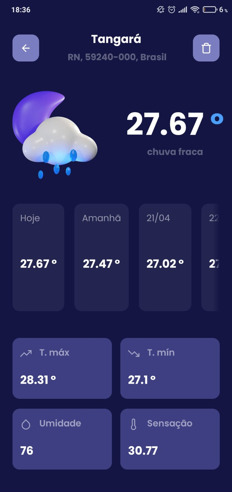

<h1 align="center" style="color: #4B9FF8;">WeatherApp 🌡</h1>

> Application to inform the climate of cities. Among its functions are: save cities, search locations and see the current weather and the next 5 days

### 👨🏽‍💻 Demo


### 📲 Main features
- Local storage
- Unit tests
- Design Patterns (Factory, Dependency Injection, etc)
- HTTP requests


### :rocket: Technologies used

- [React Native](https://reactnative.dev/)
- [Typescript](https://www.typescriptlang.org/)
- [Styled-Components](https://styled-components.com/)
- [Eslint](https://eslint.org/)
- [Prettier](https://prettier.io/)
- [React Native Reanimated](https://docs.swmansion.com/react-native-reanimated/)
- [Moti](https://moti.fyi/)
- [Axios](https://axios-http.com/ptbr/docs/intro)
- [Hermes](https://reactnative.dev/docs/hermes)
- [Jest](https://jestjs.io/pt-BR/)
- [React Native Testing Library](https://callstack.github.io/react-native-testing-library/)


### 🧭 Running the application

```bash
# clone this repository
$ git clone

# install the dependencies
$ yarn install

# run in the emulator or on a device
$ yarn android

```
### 🔎🐛 Running tests

```bash

$ yarn test

# or
$ yarn coverage

```

### 📱 Screenshots

<div style="display: flex; flex-direction: row; flex-wrap: wrap">





</div>

## 🧑 Author

👤 **Lucas Feliciano**

* Github: [@lucas1feliciano0](https://github.com/lucas1feliciano0)
* LinkedIn: [@lucas1feliciano0](https://linkedin.com/in/lucas1feliciano0)


❤️ 👋🏽